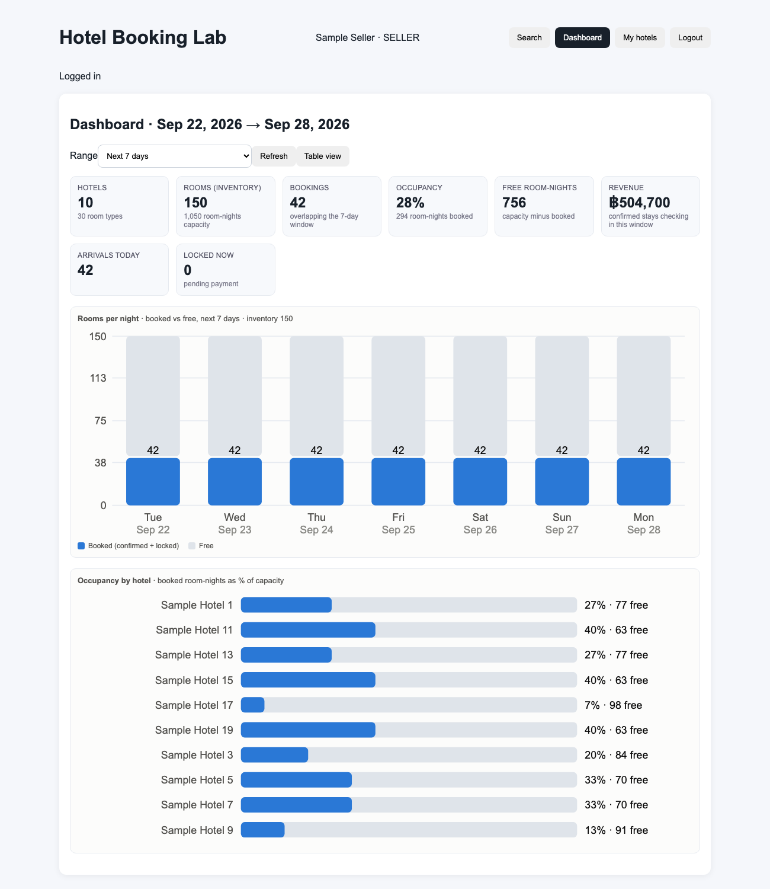
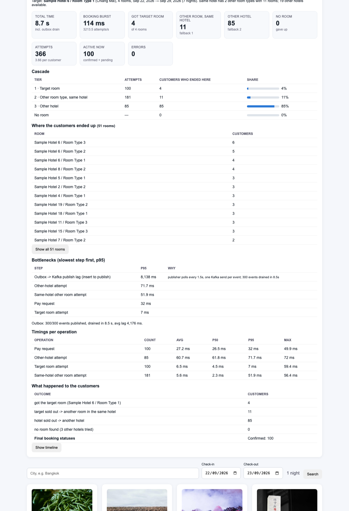

# Hotel Booking Lab

A hands-on learning project that rebuilds the core of a hotel booking platform (think Agoda / Booking.com) small enough to read in an afternoon, but with the real hard parts left in: atomic inventory under concurrency, a payment lock with timeouts, the transactional Outbox pattern into Kafka, role-based access with admin impersonation, a built-in load simulator that shows you where the bottlenecks are, and a Redis capacity test that fills Redis until it is full.

Everything runs locally with Docker Compose or Podman Compose. Nothing is production-ready on purpose: passwords are plain text and shown on the login page so anyone can try every role.



## Stack

| Layer | Choice | Why it is here |
|---|---|---|
| API | Node.js 22, TypeScript, Fastify 5 | small, fast, typed REST API |
| Web | React 19, Vite 8, TypeScript | single-file SPA, inline SVG charts |
| Source of truth | PostgreSQL 16 | users, hotels, rooms, bookings, audit log, outbox, simulation runs |
| Inventory / locks | Redis 7 + Lua | one counter per room per night for the next 365 nights, atomic all-or-nothing reservation; capped with `maxmemory` |
| Availability worker | Node.js 22, TypeScript | rolls the 365-night Redis window once a day (adds the new night, removes yesterday) |
| Events | Apache Kafka 3.9 (KRaft) + Kafka UI | domain events published from the outbox |
| Auth | JWT | roles CUSTOMER / SELLER / ADMIN, admin impersonation with audit trail |
| Containers | Docker Compose / Podman Compose | healthchecks, dependency ordering |

## Run it

```bash
podman compose up --build
# or
docker compose up --build
```

Redis is capped at 400 MB (`maxmemory`, writes are refused when full instead of the VM running out of memory). Change it with `REDIS_MAXMEMORY=1500mb podman compose up -d --force-recreate redis`, after giving the Podman VM enough RAM.

Then open:

| What | Where |
|---|---|
| Web app | http://localhost:5173 |
| API | http://localhost:3010/api/health |
| Kafka UI | http://localhost:8080 |
| PostgreSQL | `localhost:5433`, user / password / db `booking` |
| Redis | `redis://localhost:6379` |

The login page lists every account with its password; click a row to log in. On a fresh database only the admin exists (`admin@example.com` / `admin123`). Log in as admin and press **Generate Sample Data** to create 20 hotels, two sellers and two customers, with example prices: Thailand's day-of-week defaults and high season (15 Dec – 15 Jan +40%), a fixed New Year's Eve price per room type, and an autumn discount on half of the hotels. Re-running it is safe.

The login page also shows the catalogue at a glance (hotels, rooms, room-nights bookable right now) and the accounts in three tables: admins, sellers and customers.

After changing code, rebuild and recreate the containers (podman-compose does not recreate on image change by itself):

```bash
podman compose up --build -d --force-recreate --no-deps api availability-worker web
```

## What you can do

**As a customer**
- Search hotels by country and city, pick check-in / check-out dates, open a hotel to see per-night availability, the price of every night (weekend, season and holiday prices marked) and the total for the stay.
- Results show a **Sold out** badge when no room is free for every night of the selected dates, are paged (10 / 20 / 50 / 100 per page, pager above and below the results) and can be viewed as cards or as a compact list with a small picture.
- Book a room: the nights are locked for you immediately and the booking is *Awaiting payment*. Pay within 60 seconds in **My bookings** or the status becomes *Payment timed out* and the room is released.
- My bookings shows a live countdown, a Pay button, a Cancel button for upcoming stays, a stay-phase badge (Upcoming / Staying now / Completed) and a warning when two of your stays overlap.

**As a seller**
- **Dashboard**: stat tiles and charts (booked vs free rooms per night, occupancy per hotel) for the next 7 / 14 / 30 days, with a table view.
- **My hotels**: only the hotels you own, with availability and the bookings on each. Search is scoped the same way, enforced by the API.
- **Prices**: per hotel, set the base price of each room type, your own day-of-week % (an empty day uses the country default), and seasons, holidays and discounts for one room type or all. Prices stack: season × day of week − discount; a holiday replaces season and day of week. A 60-night calendar shows every room type's price, and hovering a price shows its layers. Existing bookings keep the price they were made at.

**As an admin**
- Generate / delete sample data, create sample bookings for a chosen customer, rebuild the Redis availability cache from PostgreSQL.
- **Redis records**: every room × night of the window with the value Redis holds, window check (every room has every night), Redis RAM used vs its limit. **Availability log**: every run of the availability worker.
- **Concurrency demo**: every customer books the same room at the same instant; see exactly who wins.
- **Load simulation** with a report that ranks the slowest steps (p95) and a Cancel-all button:
  - *Random rooms this week*: N customers book random rooms at once, optionally only in one country or city; a share pays, a share lets the lock expire and rebooks, the rest abandon.
  - *Same room, 7 nights*: everyone wants one room; rejected customers cascade to another room type in the hotel, then to another hotel (anywhere, same country or same city).
- **Country pricing**: each country's default day-of-week % (e.g. Israel Mon −15%, Thu +30%, Fri +40%, Sat +10%; Thailand Wed −10%, Fri +20%, Sat +30%) and national seasons and holidays. Every hotel in the country inherits them unless it overrides.
- **Redis capacity test**: generate 1,000 to 1,000,000 sellers with 1, 10 or 100 hotels each (3 room types, 365 nights, spread over 20 cities in 6 countries). Hotels are loaded in batches of 250 until done, stopped, or Redis reaches `maxmemory`; the half-loaded batch is then rolled back. Tiles show Redis RAM, keys, bytes per key and progress. **Remove capacity-test data** deletes it all again.



## How the booking flow works

1. `POST /api/bookings` runs one Lua script over every night of the stay. If any night is sold out it returns -1 and changes nothing; otherwise it decrements all nights atomically. No database lock is needed and concurrent requests cannot oversell.
2. The booking row is inserted as `PENDING` with `expires_at = now() + 60s`, together with `booking.created` and `room.availability.changed` rows in the `outbox_events` table, in the same transaction.
3. `POST /api/bookings/:id/pay` is a single conditional `UPDATE ... WHERE status='PENDING' AND expires_at > now()`, so a late payment and the expiry worker can never both win.
4. A worker moves expired `PENDING` rows to `PAYMENT_TIMEOUT` (`FOR UPDATE SKIP LOCKED`), gives the nights back to Redis and writes `booking.payment_timeout`.
5. The outbox publisher sends unpublished events to Kafka and stamps `published_at`. Watch the topics in Kafka UI: `booking.created`, `booking.confirmed`, `booking.payment_timeout`, `booking.cancelled`, `room.availability.changed`.
6. Redis is treated as a cache: at startup (and from the admin panel) the per-night counters are rebuilt from the bookings table, 200 rooms at a time. The availability worker keeps exactly 365 nights per room loaded, rolling the window after UTC midnight.

More detail in [ARCHITECTURE.md](ARCHITECTURE.md).

## What the load simulation showed

100 customers booking at once on a laptop, single API instance:

| Step | p95 |
|---|---|
| Outbox to Kafka publish lag | ~12 s |
| Payment-timeout worker delay | ~1 s |
| PostgreSQL booking transaction | ~77 ms |
| Booking request end to end | ~78 ms |
| Redis Lua reservation | ~3 ms |

The publisher (1.5 s poll, one Kafka send per event) is the bottleneck by two orders of magnitude; Redis is negligible. Obvious next steps: batch the Kafka sends, replace polling with `LISTEN/NOTIFY`, shorten the worker interval.

## What the Redis capacity test showed

Podman VM with 2 GB RAM, Redis capped at 400 MB:

| Measure | Result |
|---|---|
| Memory per availability key | ~110 bytes (key name ~60 chars + Redis bookkeeping) |
| Memory per hotel (3 room types × 365 nights) | ~120 KB |
| Load speed | ~600,000 keys / s (1,000 hotels in 1.6 s) |
| Full at | ~4.1 million keys ≈ 3,750 hotels |
| Remove 3,750 hotels | ~7 s |

When Redis is full it refuses writes, so new bookings fail too. One key per room per night means memory grows with the catalogue, not with bookings: 10,000 hotels need ~1.2 GB, 1,000,000 hotels ~120 GB. Storing only booked nights (capacity minus bookings, one small hash per room per month) would make memory grow with bookings instead; that is the planned next step.

## API overview

| Method | Path | Role |
|---|---|---|
| GET | `/api/auth/demo-accounts` | public, lists every account (learning project) |
| POST | `/api/auth/login` | public |
| GET | `/api/stats` | public, hotels / rooms / bookable room-nights |
| GET | `/api/locations` | public, countries and cities with hotel counts |
| GET | `/api/hotels?country=&city=&page=&limit=&checkIn=&checkOut=` | public, sellers see only their own; with dates adds `soldOut` |
| GET | `/api/hotels/:id?checkIn=&checkOut=` | public, per-night availability |
| POST | `/api/bookings` `{ roomId, checkIn, checkOut }` | customer, locks the room |
| POST | `/api/bookings/:id/pay` | customer |
| POST | `/api/bookings/:id/cancel` | customer |
| GET | `/api/bookings/me` | customer |
| GET | `/api/seller/dashboard?days=7` | seller |
| GET | `/api/seller/hotels`, `/api/seller/hotels/:id/bookings` | seller |
| GET | `/api/seller/hotels/:id/prices?from=&days=60` | seller, base prices, rules and price calendar |
| PATCH | `/api/seller/rooms/:id` `{ price }` | seller, base price |
| PUT | `/api/seller/hotels/:id/weekdays` `{ pct: (number or null)[7] }` | seller, day-of-week %, null = country default |
| POST / DELETE | `/api/seller/hotels/:id/price-rules` `{ kind: SEASON/HOLIDAY/DISCOUNT, name, roomId?, startDate, endDate, adjustType, adjustValue }`, `/api/seller/price-rules/:id` | seller |
| GET | `/api/admin/country-pricing` | admin |
| PUT | `/api/admin/country-pricing/:country/weekdays` `{ pct: number[7] }` | admin |
| POST / DELETE | `/api/admin/country-pricing/:country/rules` `{ kind: SEASON/HOLIDAY, … }`, `/api/admin/price-rules/:id` | admin |
| GET | `/api/admin/users` | admin |
| POST | `/api/admin/impersonate/:userId` | admin |
| POST / DELETE | `/api/admin/sample-data` | admin |
| POST | `/api/admin/sample-bookings` `{ userId }` | admin |
| POST | `/api/admin/concurrent-booking` `{ roomId, checkIn, checkOut, confirm? }` | admin |
| POST | `/api/admin/simulation` `{ mode, customers, payRatio, lateRatio, windowSeconds, roomId?, country?, city?, fallbackScope? }` | admin, then `GET /api/admin/simulation/:id`, `POST .../cancel-all` |
| POST | `/api/admin/rebuild-availability` | admin |
| GET | `/api/admin/redis-records?hotelId=&night=&page=&limit=` | admin |
| GET | `/api/admin/availability-log` | admin |
| GET / POST / DELETE | `/api/admin/load-test` `{ sellers, hotelsPerSeller }`, `POST /api/admin/load-test/stop` | admin, Redis capacity test |

## Project layout

```
apps/api/src/server.ts   Fastify API, workers, simulation, capacity test (single file on purpose)
apps/availability-worker/src/worker.ts   daily roll of the Redis availability window
apps/web/src/main.tsx    React SPA
apps/web/src/style.css
database/init.sql        schema for a fresh database (the API also migrates older ones)
docker-compose.yml
docs/                    screenshots
```

## Not production-ready, by design

Plain-text passwords, no rate limiting, no tests, one API instance, in-process workers. The [architecture notes](ARCHITECTURE.md) end with the list of upgrades that would turn this into something real.
